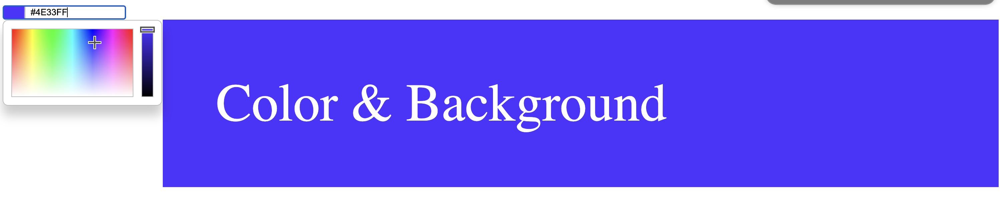

 <div align="center" id="top"> 
  

&#xa0;

</div>

<h1 align="center">Neural network 1</h1>
<div align="center">
  
</div>

<p align="center">
  <a href="#dart-about">About</a> &#xa0; | &#xa0; 
  <a href="#sparkles-features">Features</a> &#xa0; | &#xa0;
  <a href="#rocket-technologies">Technologies</a> &#xa0; | &#xa0;
  <a href="#construction_worker-Roadmap">Roadmap</a> &#xa0; | &#xa0;
  <a href="#white_check_mark-requirements">Requirements</a> &#xa0; | &#xa0;
  <a href="#checkered_flag-starting">Starting</a> &#xa0; | &#xa0;
  <a href="#memo-license">License</a> &#xa0; | &#xa0;
  <a href="https://github.com/JBD84" target="_blank">Author.</a>
</p>

<br>

## :dart: About

This is simple use of IA = Neural network

Technology & Reality merging
"In a world that everythink in programable, your only limit is your imagination."

## :sparkles: Features

:heavy_check_mark: Problem and Solution
:heavy_check_mark: Learn AI
:heavy_check_mark: The Result neural network

## :rocket: Technologies

The following tools were used in this project:

- [Javascript](https://javascript.com/)
- [CSS] (https://css.com/)
- [HTML](https://html.com/)


## :construction_worker: Roadmap

<ul>
<li>Check out the ways to get started.
<li>Browse inside 
<li>Enjoy the experience
</ul>

## :white_check_mark: Requirements

Before starting :checkered_flag:, you need to have [Git](https://git-scm.com) installed.

## :checkered_flag: Starting

```bash
#The best way
$ paste it into your browser https://neuralNetorkIA.github.io
# Clone this project
$ git clone https://github.com/JBD84/neuralNetorkIA.github.io

```

## :memo: License

This project is under license from MIT. For more details, see the [LICENSE](LICENSE.md) file.

Made by: Heart & Pasion <a href="https://github.com/JBD84" target="_blank">Javier Bambaren D.</a>

&#xa0;

<a href="#top">Back to top</a>
